HIV-SCAN-CER
================
Antoine Chaillon and Davey M Smith
2023-12-25

------------------------------------------------------------------------

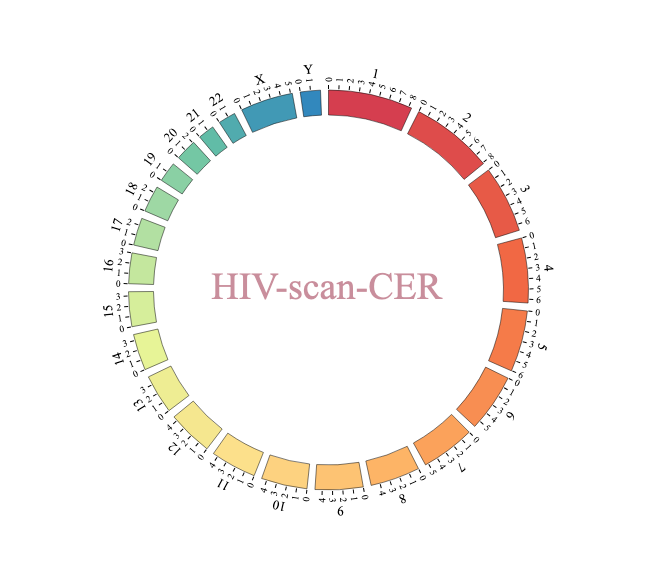<!-- -->

------------------------------------------------------------------------

# Context

Despite the efficacy of `antiretroviral therapy (ART)`,
`individuals living with HIV` confront an elevated susceptibility to
**non-AIDS related cancers**, representing a substantial health burden.
As infectious disease physicians, virologists and investigators of the
[Last Gift cohort](https://lastgift.ucsd.edu/), our extensive
involvement spans years of investigating HIV persistence. Our goal is to
uncover innovative approaches that enhance the overall life expectancy
and well-being of individuals living with HIV. Our efforts are
concentrated on identifying proactive measures and treatment strategies
to address non-AIDS related cancers associated with HIV.

# Introduction

HIV-1, known for `integrating` into immune cells like CD4+ T cells,
triggers their abnormal expansion and impairs their function.
Understanding how HIV affects the body’s immune response against tumors,
both within and outside the **tumor microenvironment (TME)**, is crucial
to unraveling the mechanisms behind cancer progression in individuals
living with HIV.

Building upon our expertise on new sequencing techniques, we have
implemented an [analytical pipeline for identifying and mapping the
integration sites](https://pubmed.ncbi.nlm.nih.gov/32151239/) of
HIV[^1].

Leveraging Last Gift cohort tissue samples from PWH and diagnosed with
solid tumors, we have characterized the distribution of HIV integration
along the human genome in immune cells in `tumoral` and `non tumoral`
tissues. We further investigated how this may impact genes whose
expression regulate tumor growth, cell apoptosis or tumor specific
immune response (e.g. `tumor suppressor genes`).

In PWH diagnosed with solid tumor (e.g. `Lung adenocarcinoma`,
`breast cancer`, `anal squamous cell cancer`), we have identified large
clonal expansion of HIV infected cells with integration sites within or
upfront critical genes known to be associated with tumor control. We
believe that this may have impacted the course of cancer progression,
response to treatment and overall prognosis of these patients.

------------------------------------------------------------------------

Expanding on these findings, we suggest integrating
`HIV integration site sequencing` into the **comprehensive screening
protocol** for individuals living with HIV. By detecting HIV integration
hotspots in key locations early on, we aim to bolster preventive
measures and prompt interventions for patients at risk or showing
pre-cancerous conditions.

This approach also provides valuable insights into the mechanisms
driving tumor development and rapid growth.

------------------------------------------------------------------------

# Approach worflow

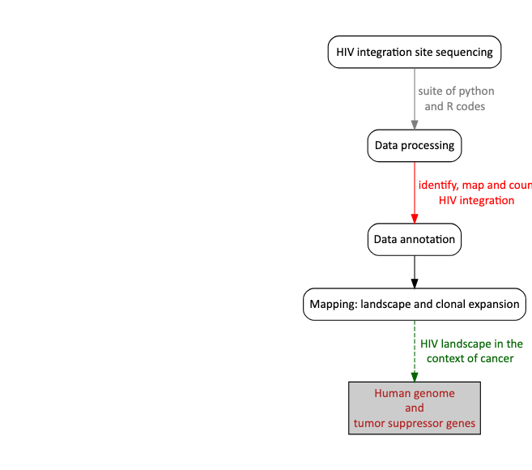<!-- -->

------------------------------------------------------------------------

# Overview of the bioinformatic pipeline

This pipeline has been developed in our lab with the invaluable support
of D. Wells following this
[protocol](https://pubmed.ncbi.nlm.nih.gov/32151239/). Of note,
downstream analyses can be adapted to other sequencing protocols and we
anticipate to continue leveraging the most advanced sequencing
techniques to further improve the sensitivty and specifity of HIV
integration site sequencing.

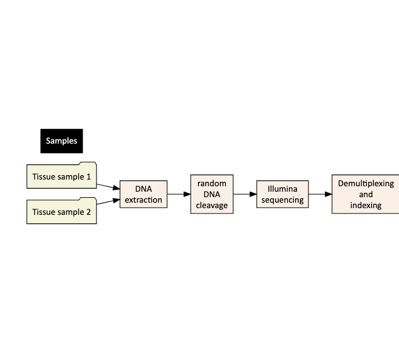<!-- -->

# Sequencing data processing

Each sample is processed in python and require an individual **setting
file** with barcode sequences and linkers. Below is one example for pid
`LG28` and sample `PCT` . Fastq files are:

- `LG28-PCT_S1_L001_R1_001.fastq.gz`
- `LG28-PCT_S1_L001_R1_001.fastq.gz`

``` yaml
<PE1barcodes> 
SD505
SD506
<PE2barcodes> 
D703
<LTR>
3LTR
5LTR
<3LTR_primer>
CACTTTTAGTCAGTGTGGAAAATC
<3LTR_junction>
TCTCTAGCA
<5LTR_primer>
TCTTGTCTTTGCTGGGAGTGAATTA
<5LTR_junction>
CCCTTCCA
<file_name_template>
LG28-PCT-IS_S1_L001_R1_001.fastq.gz
<pairs> # The number of pairs of fastq.gz files per sample
1
```

Process each sample with the following

- Set your folder

``` cpp
// [[Rcpp::export]]
2_blat_pipeline.pl -b blat -g ./HumanGenome/
```

- Followed for each sample and PE output by:

``` cpp
// [[Rcpp::export]]
1_demultiplex.pl settings_file.txt
2_blat_pipeline.pl ./3LTR/PE1_SC505_PE2_D703.txt.gz
2_blat_pipeline.pl ./5LTR/PE1_SB506_PE2_D703.txt.gz
```

Now you are set for `data analyses`.

# Evaluate sequencing depth and quality mapping

We recommend to prepare sample sheet with all samples in your study for
data analysis as follow:

| pid  | acronyms | LTR  | linker | barcode | location                   | groups                 |
|:-----|:---------|:-----|:-------|:--------|:---------------------------|:-----------------------|
| LG08 | LNO      | 3LTR | D703   | SA504   | Lymph Node (other)         | Lymphoid tissues       |
| LG08 | LNO      | 5LTR | D703   | SA505   | Lymph Node (other)         | Lymphoid tissues       |
| LG08 | LNOT     | 3LTR | D705   | SA506   | Lymph Node (other) - tumor | Lymphoid tissues       |
| LG08 | LNOT     | 5LTR | D705   | SA507   | Lymph Node (other) - tumor | Lymphoid tissues       |
| LG08 | ILM      | 3LTR | D705   | SA504   | Ileum                      | Gastrointestinal tract |

- Sequencing read metrics:

Next check number of reads kept at each step for both `LTRs`:

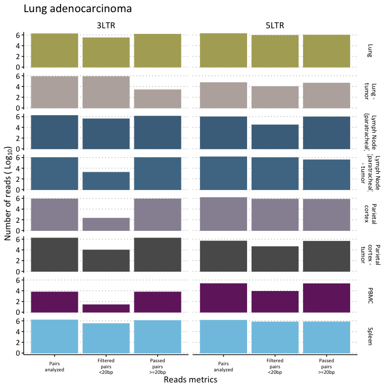<!-- -->

## Annotation of bed files using [ChIPseeker v1.38.0](https://pubmed.ncbi.nlm.nih.gov/36286622/)

    ## GRanges object with 143 ranges and 0 metadata columns:
    ##         seqnames              ranges strand
    ##            <Rle>           <IRanges>  <Rle>
    ##     [1]     chr1   10955531-10955693      -
    ##     [2]     chr1   13825779-13825928      +
    ##     [3]     chr1   16519662-16519774      -
    ##     [4]     chr1   19223170-19223577      -
    ##     [5]     chr1   19516325-19516408      +
    ##     ...      ...                 ...    ...
    ##   [139]     chrX   45644916-45645007      +
    ##   [140]     chrX   77278243-77278466      +
    ##   [141]     chrX   93306060-93306149      -
    ##   [142]     chrX 111106807-111106833      -
    ##   [143]     chrX 153682569-153682615      +
    ##   -------
    ##   seqinfo: 23 sequences from an unspecified genome; no seqlengths

- Feature plot:

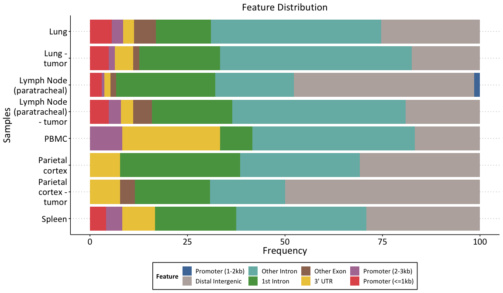<!-- -->

# Mapping HIV integrations sites and identify clonally expanded HIV infected cells

- Overall proportion of clonally expanded HIV infected cells

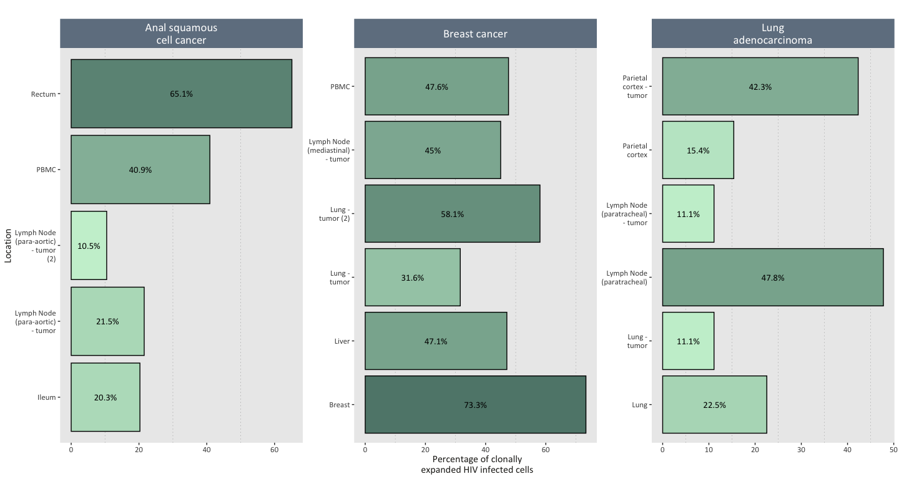<!-- -->

- Clonally expanded HIV infected cells and targeted genes

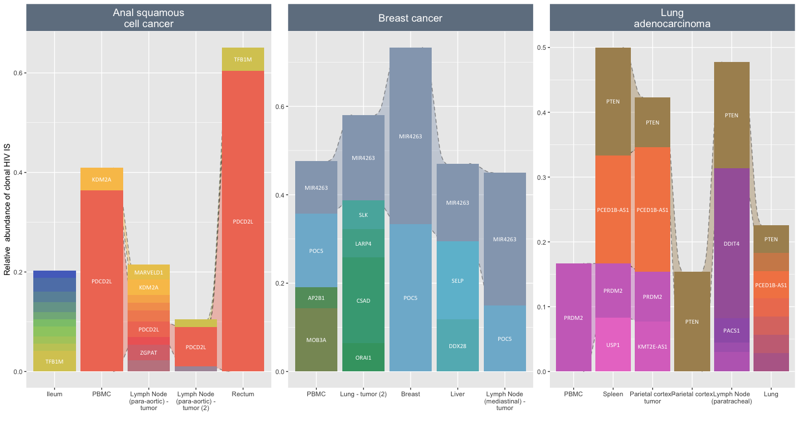<!-- -->

------------------------------------------------------------------------

# Landscape of HIV integration site along the human genome

<!-- Using karyoploteR as described [here](https://www.biostars.org/p/231636/) -->

------------------------------------------------------------------------

## Approach

Our next step involves contextualizing the specific locations where HIV
integrates into immune cells within the human genome. We aim to
correlate these integration sites with identified genes responsible for
regulating tumor growth and influencing the local immune response’s
progression.

A critical step is to develop a **comprehensive database of genes
involved in tumor regulation and their impact on the immune response in
various types of solid tumors**. There are several databases and
resources available that compile such information

- [The Cancer Genome Atlas
  (TCGA)](https://www.cancer.gov/ccg/research/genome-sequencing/tcga):
  TCGA provides comprehensive genomic data across various cancer types,
  including information on gene expression, mutations, and their
  correlation with immune responses.

- [ImmPort](https://www.immport.org/shared/home): This database focuses
  on immunology-related data, including gene expression and immune cell
  profiles associated with different cancers.

- [Genomic Data Commons (GDC)](https://gdc.cancer.gov/): GDC offers
  access to cancer genomic and clinical data, allowing researchers to
  explore gene expression patterns and their relation to immune
  responses in solid tumors.

- [cBioPortal for Cancer Genomics](https://www.cbioportal.org/): This
  resource provides access to multidimensional cancer genomics data,
  enabling the exploration of genes involved in tumor progression and
  their connections to the immune system.

- The [Human Protein Atlas](https://www.proteinatlas.org/): While not
  solely focused on cancer, this atlas provides information on protein
  expression in various tissues, including those related to the immune
  response in different cancers.

Other sources of information include regular literature review to
identify all new putative [tumor suppressor
genes](https://pubmed.ncbi.nlm.nih.gov/10333246/).

<!-- Other sources of data: -->
<!-- -    [COSMIC](https://cancer.sanger.ac.uk/cosmic/download) Cancer gene somatique mutation database -->
<!-- -    [Genomic](https://www.ncbi.nlm.nih.gov/pmc/articles/PMC3092285/#:~:text=1)%2C%20including%20those%20already%20known,the%20mutated%20oncogenes%20described%20above.) -->

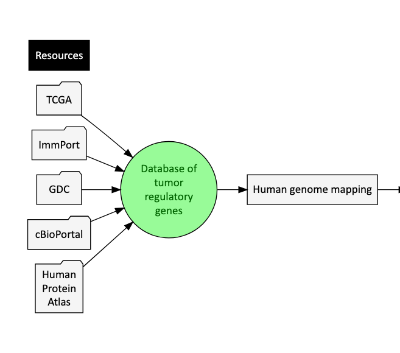<!-- -->

------------------------------------------------------------------------

## Landscape of HIV IS

Only 3 tissues (tracks) per participant are shown

### Participant with anal squamous cell carcinoma (SCC)

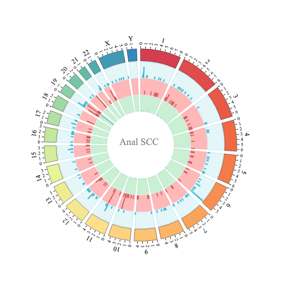<!-- -->

### Participant with breast cancer

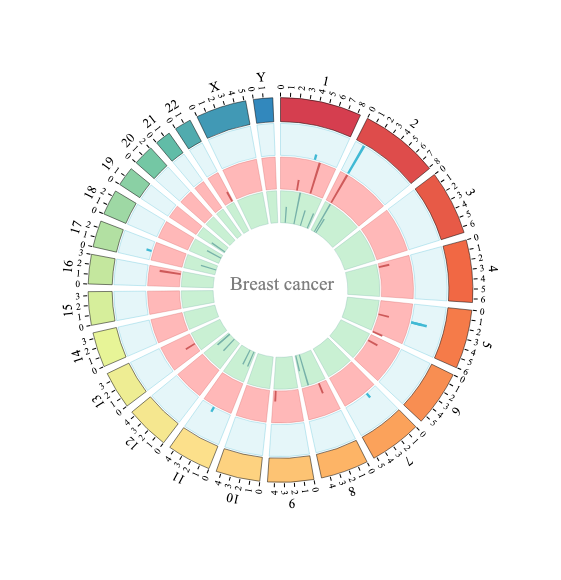<!-- -->

### Participant with lung adenocarcinoma

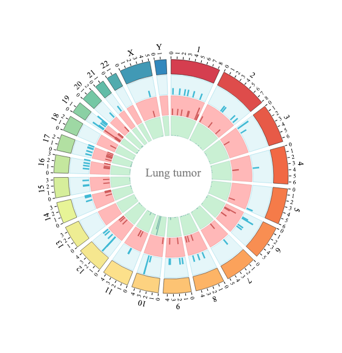<!-- -->

------------------------------------------------------------------------

## Tumor and HIV lanscape

### Participant with lung cancer

HIV integration site data revealed a high level of clonal HIV infected
cells, ranging from 11 to 48%, and integration in **tumor suppressor
gene Phosphatase and TENsin homolog on chromosome 10 (PTEN)** gene
shared across tissues.

A comprehensive PTEN status analysis could be crucial to refine the
prediction of response to therapy in individuals with HIV diagnosed with
solid tumor and to define new combinatorial approaches, to tailor the
right therapies to patients who can benefit the most.

PTEN is one of the most frequently inactivated tumor suppressors in
human cancer; moreover, even a partial loss of its function may cause
[neoplastic
transformation](https://pubmed.ncbi.nlm.nih.gov/30925702/)(<https://pubmed.ncbi.nlm.nih.gov/29858604/>).
Mounting evidence suggest that not only PTEN expression (or lack
thereof) in cancer cells attracts different immune cell populations to
the TME; but also, PTEN function in immune cells regulates their
activation status, shifting the balance towards an [immunosuppressive
TME](https://pubmed.ncbi.nlm.nih.gov/32000794/)(<https://pubmed.ncbi.nlm.nih.gov/31501268/>).

Beyond PTEN, understanding the implications of gene regulation by HIV
integration in cancer immunoediting and immune evasion is crucial to
develop new cancer intervention strategies.

- Genes with known somatic mutations

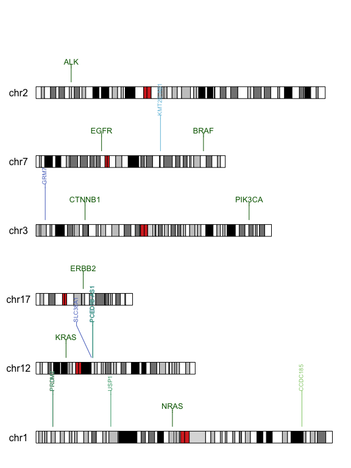<!-- -->

- Tumor suppressor genes

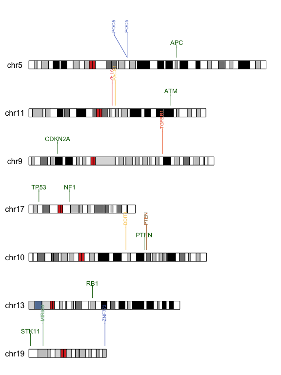<!-- -->

## Participant with breast cancer

This patient was diagnosed with a breast cancer. we identified large
clonal HIV infected cells in tumor and non-tumor tissues, with
integration sites in genes such as `POC5` or `MIR4263`.

POC5 has a low cancer and low immune specificity. known [prognostic
marker in liver
cancer](https://www.proteinatlas.org/ENSG00000152359-POC5)

Analysis of patient survival data revealed that POC5 primary tumor
expression was correlated with distant metastasis-free survival in
patients with basal-like breast cancer. Sequence variation in the POC5
gene may be important in understanding differences in genetic background
that favor development of basal subtype human breast cancer. POC5 was
also found to be mutated in luminal breast cancer.

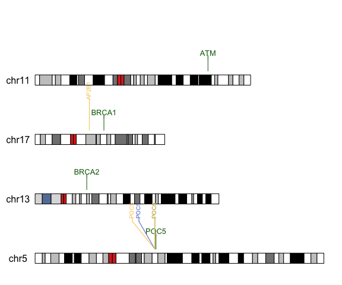<!-- -->

### Participant with anal SCC

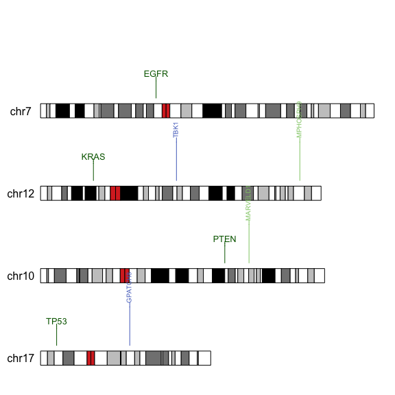<!-- -->

# Future directions

Our discovery necessitates expanded research encompassing individuals at
various stages of pre-tumor and tumor development, spanning diverse risk
conditions among those living with HIV.

We anticipate that the costs involved will be offset by the substantial
public health gains, directly enhancing the quality of life for
individuals with HIV.

Moreover, this investigation stands to significantly advance our
comprehension of solid tumor progression, benefiting not only those with
HIV but also contributing to a broader understanding applicable to all
individuals affected by these conditions.

[^1]: Collaborative work with Dr D. Wells
